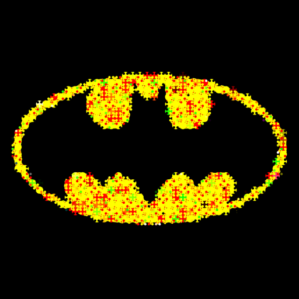

<table>
  <tr>
    <td width="170">
      
    </td>
    <td>
This repo is a Zed fork personalized for parallelization across multiple repos and worktrees. I named it "Batcave" because I like Batman, and having my work stored in a personal code editor feels like having my own Batcave. Originally, I was gonna name it "Zod" like General Zod from Superman, since it was so similar to Zed, but I like Batman more.
  </td>
  </tr>
</table>

> [!IMPORTANT]
> Remove this line to confirm you've reviewed this PR before submitting.

# Batcave

<p align="center">
  
</p>

Welcome to my Batcave.

This is a fork of [Zed](https://github.com/zed-industries/zed) — the high-performance, multiplayer code editor from the creators of [Atom](https://github.com/atom/atom) and [Tree-sitter](https://github.com/tree-sitter/tree-sitter) — that I've personalized for parallelizing workflows.

It's called Batcave because I like Batman, and this is my own personal tool. My own batcave, if you will. It's built the way I like it, with the things I use every day.

[](https://github.com/andrewlau624/bonsai/actions/workflows/run_tests.yml)

---

### Installing

Build the app and install it into your Applications folder:

```sh
./script/install
```

This compiles a release build, bundles `Batcave.app`, and moves it into `/Applications`. (Under the hood it's `./script/bundle-mac -i`.)

### Updating

```sh
./script/update-fork
```

This pulls the latest upstream Zed, rebases your fork-specific changes on top of it, bumps the patch version in `crates/zed/Cargo.toml`, and tags the result `batcave-vX.Y.Z`. If the rebase hits conflicts, resolve them and run `git rebase --continue`.

### Developing Batcave

- [Building Zed for macOS](./docs/src/development/macos.md)
- [Building Zed for Linux](./docs/src/development/linux.md)
- [Building Zed for Windows](./docs/src/development/windows.md)

### Contributing

See [CONTRIBUTING.md](./CONTRIBUTING.md) for ways you can contribute to Zed.

Also... we're hiring! Check out our [jobs](https://zed.dev/jobs) page for open roles.

### Licensing

Zed source code is licensed primarily under GPL-3.0-or-later, with Apache-2.0 components where marked.

License information for third party dependencies must be correctly provided for CI to pass.

We use [`cargo-about`](https://github.com/EmbarkStudios/cargo-about) to automatically comply with open source licenses. If CI is failing, check the following:

- Is it showing a `no license specified` error for a crate you've created? If so, add `publish = false` under `[package]` in your crate's Cargo.toml.
- Is the error `failed to satisfy license requirements` for a dependency? If so, first determine what license the project has and whether this system is sufficient to comply with this license's requirements. If you're unsure, ask a lawyer. Once you've verified that this system is acceptable add the license's SPDX identifier to the `accepted` array in `script/licenses/zed-licenses.toml`.
- Is `cargo-about` unable to find the license for a dependency? If so, add a clarification field at the end of `script/licenses/zed-licenses.toml`, as specified in the [cargo-about book](https://embarkstudios.github.io/cargo-about/cli/generate/config.html#crate-configuration).

## Upstream

This fork is built on top of [Zed](https://github.com/zed-industries/zed), developed by **Zed Industries, Inc.** — a for-profit company. If you'd like to support the original project, check out their [GitHub Sponsors](https://github.com/sponsors/zed-industries) page.
